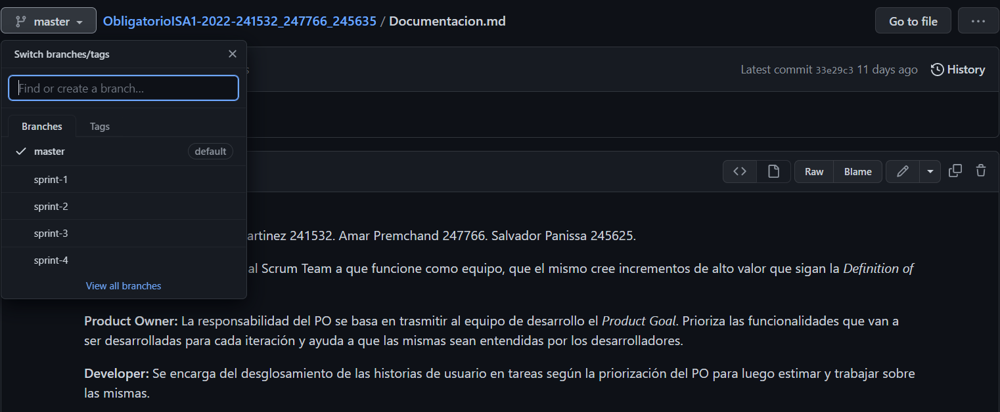

## Sprint review & retrospective

Como cierre de cada iteración celebramos las ceremonias de sprint review y retrospective donde el equipo realizó una llamada a través de la aplicación de _Discord_ con el fin de evaluar posibles mejoras acerca del producto y del desarrollo así como también revisar las prioridades del product backlog y en el caso de que fuera necesario priorizar nuevamente; por otro lado, reflexionamos acerca de nuestros puntos débiles a la hora de trabajar y organizarnos, y con lo anterior poder enriquecer nuestra actuación y adquirir una mayor eficiencia en las siguientes iteraciones. Ambas ceremonias fueron de gran utilidad ya que nos ayudaron a tener un mejor control del proyecto y del trabajo que se iba llevando a cabo, además de un mayor desempeño individual y colectivamente en el correr de las iteraciones.

##### Evidencia de celebraciones

## GitHub

A lo largo del proyecto nos manejamos con github donde por cada iteración se creó una rama correspondiente a la misma con el objetivo de una mayor organización. El equipo trabajó de manera conjunta en un documento en drive para así trabajar de forma simultánea, luego finalizada actualizamos la documentación para luego volcar todo en el archivo .md del proyecto. 
Debido a la forma de trabajo realizada todos los integrantes del equipo estuvieron al tanto de cada actualización de la documentación, por lo tanto al momento de agregar el archivo al proyecto, ya existía un consenso del equipo de lo que había sido agregado; por lo comentado anteriormente entonces no hay existencias de pull requests en el github.
Al final de cada sprint se realizó un merge con la rama master como sinónimo de entrega al usuario final.

## Forma de trabajo:

El proyecto fue guiado por la metodología de Scrum siendo este un marco de trabajo para desarrollo ágil de software. Con respecto a la forma de trabajo, si bien seguimos las ceremonias de Scrum, cada integrante tuvo la libertad de realizar sus tareas en el tiempo y de la manera que este quisiera sin imponer una manera específica de resolverlo.
Se realizó con todo el product backlog definido y el mismo tuvo como consecuencia un prototipo muy acertado de lo que deseabamos y esperabamos realizar. De manera progresiva el equipo fue mejorando su organización lo cual finalizó en una mejora en rendimiento y eficiencia, además el equipo trabajó de manera constante y consistente. Pudimos experimentar las buenas técnicas de ingeniería y llevarlas a cabo, para así entender los beneficios de aplicarlas.
A su vez, este trabajo nos permitió familiarizarnos con los distintos tipos de herramientas que fueron útiles para el desarrollo y el trabajo en equipo, Figma para el prototipado y Azure DevOps para la organización del proyecto en general.

## Link al video demo del prototipo:

