**Estudiantes:** 
Pablo Tomas Martinez 241532.
Amar Premchand 247766.
Salvador Panissa 245625.

**Scrum Master:** El SM ayuda al Scrum Team a que funcione como equipo, que el mismo cree incrementos de alto valor que sigan la *Definition of Done*. 

**Product Owner:** La responsabilidad del PO se basa en trasmitir al equipo de desarrollo el *Product Goal*. Prioriza las funcionalidades que van a ser desarrolladas para cada iteración y ayuda a que las mismas sean entendidas por los desarrolladores.

**Developer:** Se encarga del desglosamiento de las historias de usuario en tareas según la priorización del PO para luego estimar y trabajar sobre las mismas.

Como equipo es importante destacar que debe de haber una buena comunicación entre las tres partes para que las mismas estén de acuerdo con el rumbo del proyecto, además tratar de minimizar conflictos y maximizar trasparencias con el fin de que el proyecto no se vea perjudicado.

### Criterios de estimación utilizados:
Por un lado, uno de los criterios de estimación utilizados fue la de "T-Shirt Size", el cual consiste en estimar los ítems
con las talles que tienen las remeras (XS, S, M, L). Se decidió optar por esta técnica ya que el equipo es nuevo en la estimación ágil y
además es una forma más fácil de entender la cantidad de esfuerzo que se requiere.
Por otro lado, para complementar el criterio mecionado anteriormente, se utilizó la analogía. Esto consiste en comparar las historias de
usuario entre sí para asumir la estimación requerida. Por ejemplo, si tenemos una historia de usuario estimada para una semana,  y otra que contiene más tareas, se le va a asignar una estimación mayor.

### Definition of Ready:
Se trata de inspeccionar que los items del Product Backlog sean comprendidos por el equipo de desarrollo y además que cada item cumpla con las siguientes características: Independiente, negociable, estimable, valuable, pequeña y testeable. En el caso de este proyecto, los ítems del backlog deberán ser escritas en formato de historia de usuario. Además al ser un equipo pequeño, cada integrante se aseguró de que se cumplan los requisitos y que sea comprensible con el fin de llegar a una estimación en conjunto de manera ágil.

### Definition of Done:
La definición de *Done* describe que es necesario para que el próximo incremento del producto pueda darse por finalizado y entregable a un usuario final. Para darse por terminado la siguiente iteración, se comprueba que todos los requerimientos solicitados para esa iteración hayan sido cumplidos y que no se encuentre nada incompleto. Según esta definición; en el proyecto, el equipo se asegura de haber cumplido con el objetivo de cada iteración y tener la documentación al día .

# Sprint 1

### Roles:

Pablo Tomas Martinez (Developer).
Amar Premchand (Scrum Master, Developer).
Salvador Panissa (Product Owner).

#### Responsabilidad de cada rol

# **Identificación del problema a resolver**

Ayudar al usuario con el transporte público en el día a día.

# **Definición de interesados**

Al tratarse de una aplicación de transporte público, está dirigida principalmente a personas de cualquier edad que utilicen o desean utilizar este medio como transporte, como usuarios finales.

Aun así, existen otros interesados como las entidades municipales que ofrecen los datos públicos de sus transportes y a través de esta aplicación un mayor porcentaje de gente podrá acceder a esa información y así aumentar su ganancia.

También, otro posible interesado (dependiendo del modelo de negocio de la aplicación) sería el Anunciante. El interés de esta entidad se da ya que necesita disponer de un espacio para anunciar sus productos y promocionarse. Por medio de anuncios, esta aplicación podría proveer ese espacio.

Para este sprint se definieron dos tipos de interesados que son los usuarios que van a utilizar el sistema. Estos son los usuarios registrados que son los que pueden navegar por la aplicación y acceder a todas las funcionalidades y no registrados que son usuarios que pueden navegar por la aplicación, pero pueden utilizar una gama de funcionalidades limitadas como por ejemplo: no pueden guardar su historial de viajes.

**Comparación con otras herramientas**

A través del uso cotidiano de las aplicaciones competidoras podemos extraer algunas críticas que pueden mejorar la experiencia de usuario.

**Moovit:**

Una aplicación de transporte publico gratuita, disponible para IOS, Android y Windows Phone. Moovit permite al usuario obtener toda la información que necesita sobre el transporte público en más de 112 países.

Esta aplicación incluye las siguientes funcionalidades:

- Planificar un viaje: La aplicación calcula el mejor trayecto en tiempo real para que el usuario tome ese camino para dirigirse desde un determinado origen a un determinado destino.
- Buscar Horarios: Moovit permite buscar los horarios de una línea especifica. El usuario busca una línea y una parada por la que esa línea pase y puede ver cuanto demora en llegar el siguiente transporte. También, puede ver todos los horarios en los que pasa ese móvil.
- Guiar Trayectos: Ofrece un sistema de navegación que avisa al usuario por donde tiene que ir para llegar a su destino y en que parada tiene que bajarse.
- Consultar problemas en líneas: Facilita la opción de ver el estado de una línea, reportadas ya sea por usuarios o las propias compañías de transporte.

Problemas encontrados en la aplicación:

Hemos notado que a veces los horarios marcados por la aplicación no son los correctos, esto puede marcar una gran diferencia a la hora de elegir una aplicación sobre la otra, ya que, con esa fidelidad podemos asegurar a los usuarios un menor tiempo de espera en la parada, y a su vez, lograr una mejor aproximación en la hora de llegada.

También, investigando encontramos que muchos usuarios se quejan de que la aplicación funciona lento si el teléfono móvil no tiene una buena conexión a internet lo cual interfiere en la experiencia de usuario.

Otro problema encontrado es que la aplicación no muestra el precio del boleto.

**STM:**

Esta aplicación permite visualizar la ubicación del ómnibus en tiempo real, para todas las empresas de transporte. Además, se puede consultar cuánto falta para que el ómnibus llegue a la parada donde se encuentra el usuario y marcar paradas como favoritos con el fin de ubicarlas en el mapa rápidamente o hallarlas en una lista. A la vez, se puede ver los lugares de recarga y atención STM.

**CUTCSA**

CUTCSA es una aplicación de la Compañía Uruguaya de Transportes Colectivos que es la compañía de transporte más grande de Uruguay en cuanto a cantidad de unidades de transporte colectivo. Esta aplicación cuenta con todas las paradas y líneas con horarios en tiempo real que maneja la empresa. Sin embargo, cuenta con ciertos problemas:

- Muestra menos frecuencias de las que pasan debido a que no todas las unidades cuentan con GPS integrado.
- No calcula rutas, solo muestra por dónde va la línea que sale de una determinada parada.
- A veces es difícil seleccionar una parada en zonas como el centro de la ciudad donde la cantidad de paradas es mayor al resto del país.

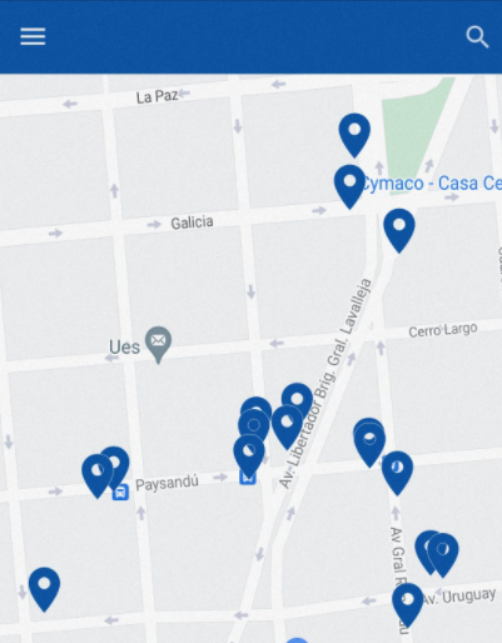

# **Lista de funcionalidades por interesado**

Por medio del estudio de la competencia y nuestro mercado objetivo podemos interpretar esta información e implementar algunas funcionalidades las cuales consideramos claves. Estas nos pueden distinguir de la competencia y a su vez son útiles al momento de hacer uso de la aplicación.

1. De manera tal de obtener la fidelidad del usuario y obtener una mayor retención de estos a lo largo del tiempo interponemos como funcionalidad más importante mejorar, de manera efectiva, la aproximación de los horarios al momento de moverse en ómnibus; con el fin de que la aplicación le diga al usuario a qué hora salir de su ubicación, caminar a la parada, subirse al ómnibus y llegar a destino con un error de uno/dos minutos.
2. Aunque es verdad que con el paso del tiempo cada vez es más fácil conseguir acceso a internet y planes con mayor número de gigas por mes a menor costo; con un sentido de ahorro decidimos implementar la opción de que la aplicación pueda ser utilizada sin tener acceso al mismo. Esto sí, a un costo, el error de aproximación aumenta ya que se necesitan datos en tiempo real para que se lleve a cabo una mejor.

**Funcionalidades**

Usuario No Registrado: 
- Registrarse para poder guardar datos personalizados por cada perfil.

Usuario Registrado:
- Recuperar contraseña para poder volver a iniciar sesión en caso de olvidarla.
- Compartir el viaje en tiempo real con otros usuarios para que puedan ver la ubicación en la que se está actualmente en un instante dado.
' Visualizar el historial de viajes pasados.

Usuario:
- Editar perfil para guardar datos personales.
- Filtrar las líneas de ómnibus de un listado.
- Obtener un listado con líneas de ómnibus cercanas a la ubicación actual.
- Conocer horarios de llegada y salida a destino especificado con precisión.
- Visualizar dónde subirse y bajarse del ómnibus dependiendo del destino especificado.
- Visualizar el trayecto del viaje en tiempo real.
- Recibir una notificación cuando el ómnibus deseado esté llegando.
- Descargar un archivo con los horarios en los que pasa el ómnibus deseado.
- Visualizar cambios no esperados en tiempo real (desvíos, atrasos, etc).

# **Historias de usuario y épicas**

## Historias de usuario

Identificador: 'US' seguido de un número identificador. Adherimos número de épica si aplica. Ej: 'US3-E1'.

Modelo:

CÓMO \<_TIPO DE USUARIO_\>

QUIERO \<_FUNCIONALIDAD_\>

PARA \<_VALOR O BENEFICIO_\>

Además, agregamos un apartado de notas como recordatorio si la historia de usuario así la requiere.

## Épicas

Identificador: 'E' seguido de un número identificador.

Modelo:

PARA \<_MOTIVO DE NEGOCIO_\>

QUIERO \<_ACCIÓN_\>

COMO \<_TIPO DE USUARIO_\>

# **Lista de épicas**

## E1:

PARA viajar de manera efectiva

QUIERO información sobre las líneas que llegan a mi destino

COMO usuario de la aplicación

## E2:

PARA guardar mi información en distintos dispositivos

QUIERO la posibilidad de crear usuarios

COMO usuario frecuente

## E3:

PARA viajar de manera segura

QUIERO implementar un modo viaje

COMO usuario

## E4:

PARA no perderme de nada

QUIERO recibir notificaciones

COMO usuario

## E5:

PARA no depender de mi conexión a internet

QUIERO poder usar la aplicación de manera offline

COMO usuario

# **Lista de historias de usuario**

## US1-E1:

COMO usuario

QUIERO filtrar líneas de un listado

PARA encontrar las que se adapten a lo buscado

NOTA: filtros por caminar menos o menos trasbordos

### Criterios de Aceptación:

**ESCENARIO 1:**

DADO un usuario introduce un destino

CUANDO se muestra el resultado (por defecto menos trasbordos)

ENTONCES se mostrará las líneas que sean directas y luego las que deba tomar como máximo dos líneas, en ese orden

**ESCENARIO 2:**

DADO un usuario introduce un destino desde su ubicación

CUANDO filtra las líneas por caminar menos

ENTONCES se mostrará primero las líneas en las que el usuario deba tomar una sola línea y caminar como máximo 1 kilómetro y luego los resultados donde deba tomar más lineas y/o caminar

## US2-E1:

COMO usuario

QUIERO un listado con las líneas cercanas a mi ubicación con información

PARA elegir una línea sobre otra

NOTA: información de parada de origen, destino.

### Criterios de Aceptación:

**ESCENARIO 1:**

DADO un usuario

CUANDO busco las líneas cercanas a mi ubicación

ENTONCES se mostrarán las líneas más próximas a la ubicación del GPS del usuario.

**ESCENARIO 2:**

DADO un usuario con el GPS desactivado

CUANDO busco las líneas cercanas a mi ubicación

ENTONCES se mostrará un mensaje que solicita que el usuario habilite su ubicación.

## US3-E1:

COMO trabajador

QUIERO conocer la hora de salida y llegada a destino de manera precisa

PARA moverme de manera efectiva y reducir tiempos de espera

### Criterios de Aceptación:

**ESCENARIO 1:**

DADO un usuario con conexión a internet

CUANDO destino del viaje

ENTONCES se calculará tomando la hora de salida actual, la hora de llegada estimada para el destino con un error de +3 minutos

**ESCENARIO 2:**

DADO un usuario con conexión a internet

CUANDO introduce destino del viaje y modifica su origen

ENTONCES se calculará el viaje desde su ubicación hasta la parada más cercana del origen y desde allí hasta el destino con un error de +3 minutos

**ESCENARIO 3:**

DADO un usuario con conexión a internet

CUANDO introduce origen, destino del viaje y además modifica la hora de partida

ENTONCES se calculará el viaje hasta la ubicación de destino teniendo en cuenta la hora de partida con un error de +3 minutos.

**ESCENARIO 4:**

DADO un usuario con conexión a internet

CUANDO introduce origen, destino del viaje y además modifica la hora de llegada

ENTONCES se calculará el viaje teniendo en cuenta la hora de llegada con un error de +3 minutos hasta la ubicación de destino

**ESCENARIO 5:**

DADO un usuario sin conexión a internet

CUANDO se encuentra en alguno de los demás escenarios, pero sin conexión

ENTONCES se calculará el viaje con un error de +-7 minutos

## US4-E2:

COMO usuario no registrado

QUIERO poder registrarme con una cuenta

PARA guardar mis paradas y líneas favoritas

### Criterios de Aceptación:

**ESCENARIO 1:**

DADO un usuario no registrado quiere registrarse

CUANDO introduce su nuevo nombre, contraseña y email

ENTONCES el sistema registra ese usuario

**ESCENARIO 2:**

DADO un usuario no registrado quiere registrarse

CUANDO introduce su nuevo nombre, contraseña y un email que ya está ingresado

ENTONCES el sistema muestra un mensaje diciendo que ya existe una cuenta con esa dirección de correo.

**ESCENARIO 3:**

DADO un usuario no registrado quiere registrarse

CUANDO introduce su nuevo nombre, contraseña invalida y un email que ya está ingresado

ENTONCES el sistema muestra un mensaje diciendo que la contraseña es poco segura y solicita que ingrese una de largo mayor a 8 con al menos un carácter especial.

## US5-E2:

COMO usuario registrado

QUIERO poder recuperar mi contraseña

PARA volver a iniciar sesión

### Criterios de Aceptación:

**ESCENARIO 1:**

DADO un usuario registrado que está tratando de ingresar al sistema olvida su contraseña

CUANDO se selecciona la opción de que olvido la contraseña

ENTONCES el sistema envía un correo a la dirección asociada al correo del usuario con instrucciones para cambiar la clave

## US6-E2:

COMO usuario registrado

QUIERO editar información de mi perfil

PARA actualizar mis datos

### Criterios de Aceptación:

**ESCENARIO 1:**

DADO un usuario registrado que está tratando de ingresar al sistema olvida su contraseña

CUANDO selecciona la opción de que olvido la contraseña

ENTONCES el sistema envía un correo a la dirección asociada al correo del usuario con instrucciones para cambiar la clave

## US7-E3:

COMO usuario

QUIERO ver las paradas de subida y bajada de mi viaje

PARA ubicarme en la ciudad

### Criterios de Aceptación:

**ESCENARIO 1:**

DADO un usuario

CUANDO selecciono origen y destino del viaje

ENTONCES el sistema le muestra al usuario como llegar desde su ubicación hasta las

## US8-E3:

COMO usuario

QUIERO ver el trayecto de mi viaje en tiempo real

PARA tener el conocimiento del mismo

### Criterios de Aceptación:

**ESCENARIO 1:**

DADO un usuario con conexión a internet

CUANDO selecciona ver el trayecto en tiempo real

ENTONCES el sistema muestra en pantalla un mapa con el camino a destino del ómnibus y las paradas que le siguen.

**ESCENARIO 2:**

DADO un usuario sin conexión a internet

CUANDO selecciona ver el trayecto en tiempo real

ENTONCES el sistema muestra en pantalla un mensaje que solicita al usuario que se conecte a internet para acceder a esta opción.

##  US9-E3:

COMO usuario registrado

QUIERO compartir mi viaje con otro usuario

PARA que mis familiares/amigos tengan mi ubicación en tiempo real

### Criterios de Aceptación:

**ESCENARIO 1:**

DADO un usuario registrado con conexión wifi que está en un viaje activo

CUANDO selecciona compartir el viaje con un amigo mediante un enlace.

ENTONCES el sistema muestra un enlace que dirige al seguimiento en tiempo real del viaje para que el usuario copie y envíe.

**ESCENARIO 2:**

DADO un usuario registrado sin conexión wifi que está en un viaje activo

CUANDO selecciona compartir el viaje con un amigo mediante un enlace.

ENTONCES el sistema muestra mensaje diciendo que tiene que estar conectado a internet para acceder a esta función

## US10-E3:

COMO usuario registrado

QUIERO visualizar el historial de mis viajes pasados

PARA volver a realizar el mismo viaje de manera rápida y cómoda

### Criterios de Aceptación:

**ESCENARIO 1:**

DADO un usuario registrado

CUANDO Selecciono para ver mi historial de viajes

ENTONCES El sistema

## US11-E4:

COMO usuario

QUIERO recibir una notificación cuando mi línea está llegando a mi origen y destino

PARA estar atento

### Criterios de Aceptación:

**ESCENARIO 1:**

DADO un usuario esperando su línea

CUANDO su línea está llegando

ENTONCES se le notifica al usuario

**ESCENARIO 2:**

DADO un usuario sin internet esperando su línea

CUANDO llega la hora supuesta de llegada de su línea

ENTONCES se le notifica al usuario

## US12-E4:

COMO usuario

QUIERO conocer si mi línea se retrasó o tiene un desvío

PARA tenerlo en cuenta a la hora de viajar

### Criterios de Aceptación:

**ESCENARIO 1:**

DADO un usuario conectado a internet

CUANDO consulta el estado de su línea

ENTONCES se devuelve el estado atrasado, cancelado, activo

## US13-E5:

COMO Usuario

QUIERO descargar las frecuencias de las líneas que frecuento o tengo en favoritos

PARA ahorrar en datos

### Criterios de Aceptación:

**ESCENARIO 1:**

DADO una línea de ómnibus

CUANDO un usuario registrado solicita descargarla

ENTONCES se utilizan los datos móviles o el wifi para descargar esa línea que queda guardada en la memoria del usuario.

## Story Map

A través de las historias de usuario y épicas detalladas previamente, el Product Owner priorizó las mismas. A su vez el equipo de desarrollo (Development Team) estimó los puntos de historia de usuario en base al conocimiento de dominio y complejidad de una historia de usuario, de esta manera estimó en base a esta misma las demás historias de usuario.

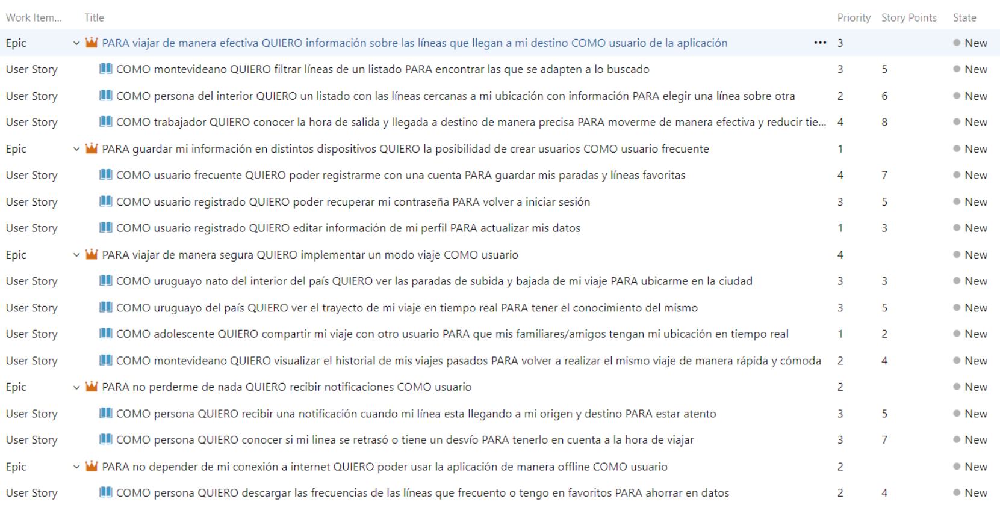

Con los _story points_ y correspondiente _priorización_, tenemos la base para crear el siguiente **Story Map** :

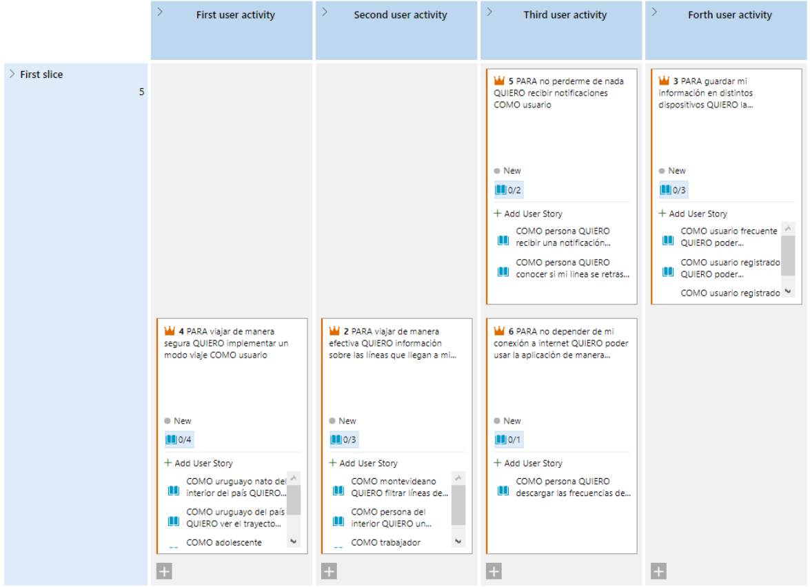

## Evidencia del Registro de Actividades

En el Sprint Planning como grupo se decide que para esta instancia de interacción cada miembro del equipo tenía como objetivo pensar en posibles interesados, user stories y/o épicas para luego presentar al Product Owner con el fin de obtener su aprobación para así definir el Product Backlog. Debido a los objetivos de esta instancia, se decide no registrar las horas trabajadas de cada integrante. Aun así, en las Daily meets cada uno mostraba su progreso en el trabajo.

Luego de que cada uno mostraba su progreso, se decide que épicas, user stories o interesados iban a ser abarcados en el desarrollo del proyecto. Se cree que esta organización fue el mejor enfoque para esta instancia ya que eran decisiones que afectan a todos los miembros del equipo por igual. En las primeras dos Daily el equipo se centró en definir cuales serían las épicas y en la tercera definimos los user stories.

El ultimo día del sprint, se realizó el Sprint Review y el Sprint Retrospective.

En el Sprint Review, como la iteración lidiaba solamente con aspectos de planificación no consideramos que el feedback de los stakeholders iba a aportar algo. Debido a esto, se le presento el incremento del trabajo a los integrantes del equipo y según diferentes opiniones se actualizaba el backlog.

En el Sprint Retrospective el scrum master del proyecto lidero la instancia mediante el análisis y la identificación de posibles mejores a aplicar en los siguientes Sprints. A la vez, se reflexionó como fue llevado a cabo este sprint llegando a la conclusión de que la metodología de trabajo ha sido resuelta de forma acertada al igual que la separación de tareas. A pesar de no haber considerado el feedback de los stakeholders en esta instancia, para las próximas si va a ser de suma importancia ya que el producto va a estar en desarrollo.

También, otra mejora seria hacer el Sprint Review y el Sprint Retrospective de forma independiente para tener una mayor organización.

En adición, otra posible mejora sería la de registrar las horas de trabajo de cada integrante para así tener un monitoreo efectivo.

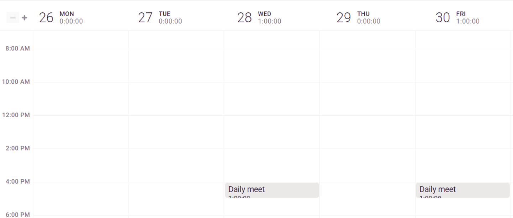

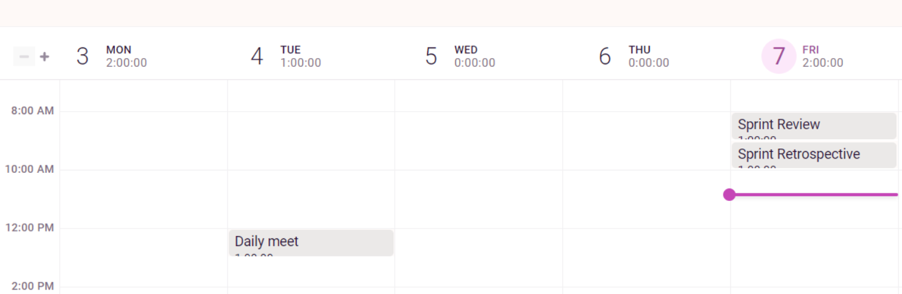

# **Sprint 2**
 
### Roles:
 
Pablo Tomas Martinez (Scrum Master, Developer).
Amar Premchand (Product Owner).
Salvador Panissa (Developer).

## Sprint planning 
 
El objetivo del siguiente sprint es lograr que el usuario pueda viajar en ómnibus a través de la ayuda de la aplicación.

## Propuesta de Valor
La propuesta de valor que ofrece nuestro proyecto no es sólo la de conocer qué rutas sirven para llegar al destino deseado, sino que se decidio brindar una experiencia completa con el fin de que nuestros usuarios puedan realizar el viaje de forma segura y eficiente. Para esto, la aplicación cuenta con un sistema de notificaciones que avisa al usuario cuando su línea está llegando a su origen y destino, y también le permite conocer si su línea se retrasó o tiene un desvío. Además, el usuario puede descargar las frecuencias de las líneas que frecuenta o tiene en favoritos para ahorrar en datos. No obstante, tambien se ofrecen funcionalidades offline para el usuario que no tiene acceso a internet, como el hecho de poder tener descargadas las líneas que frecuenta con el fin de que en el caso de que el usuario pierda la conexion a internet, aun pueda llegar a tiempo a su destino.
 
## Sprint Backlog
 
A partir de la priorización de las épicas e historias de usuario decidimos tomar las épicas número 1 y 3 con sus historias de usuario correspondientes. Lo que nos permite lo anterior es que al finalizar el sprint entregaremos un avance del producto que aportará valor al cliente, es decir, una versión temprana del producto que podrá utilizar de manera limitada.
 
Para visualizar las tareas de cada historia de usuario tomadas para el sprint decidimos utilizar Azure DevOps donde el backlog nos queda de la siguiente forma:
 
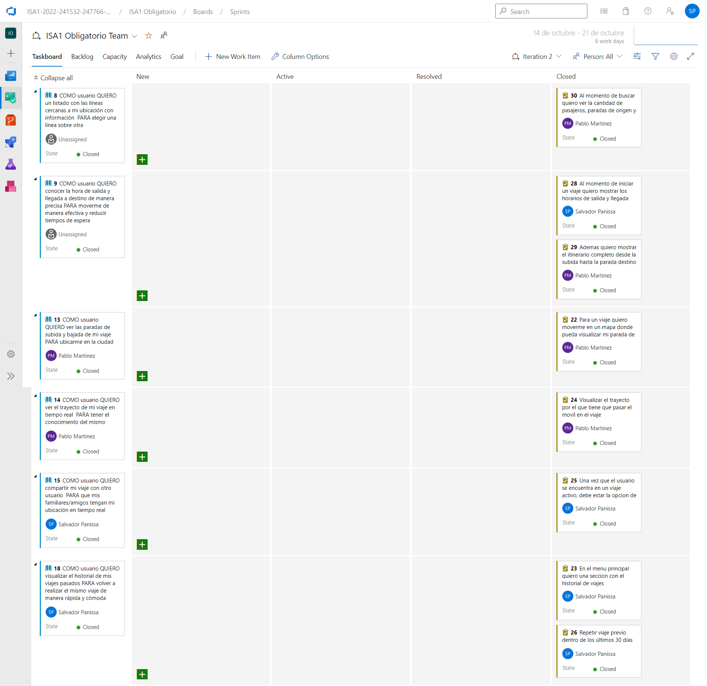

## **Prototipos**
 
Para prototipar hicimos uso de la aplicación Figma ya que contamos con experiencia previa en la misma. Realizamos las interfaces de usuarios correspondientes para cada card con el fin de representar las funcionalidades.
 
Se realizaron los prototipos que permiten desarrollar las historias de usuario de la épica definida.
 
#### US 2:
El usuario es capaz de filtrar las líneas de un listado con el fin de encontrar la línea que busca. Para ello, el usuario desde la página principal de la app accede al botón inferior derecho donde se encuentra el listado de líneas.
 
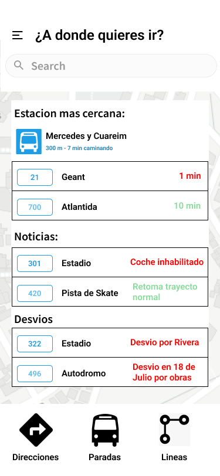
  
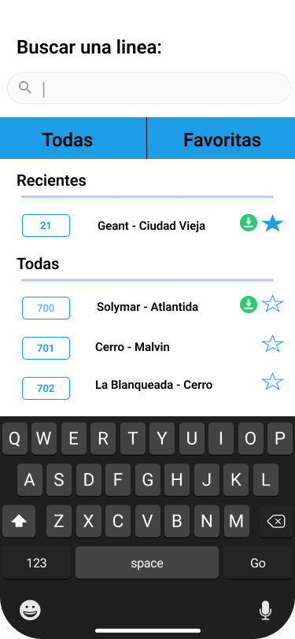

El usuario puede buscar la línea deseada mediante la barra de búsqueda encontrada en la parte superior de la aplicación.
 
#### US 3:
Desde el menú principal, el usuario va a seleccionar un destino para ir, luego el sistema muestra una el mapa del origen y destino para que el usuario verifique que es correcto el trayecto.
 
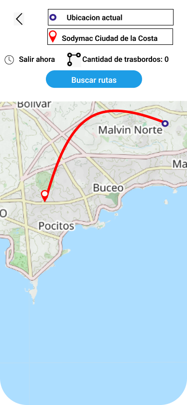

El sistema calcula las rutas y muestra las posibles combinaciones de trayectos como se puede ver en la siguiente imagen.
 
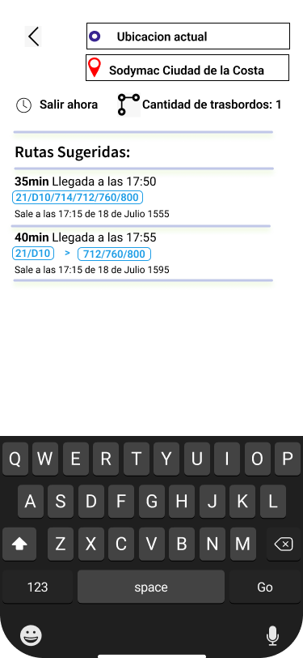
 
Una vez que el usuario selecciona una ruta. El sistema muestra en detalle el camino, paradas, direcciones y tiempo que lleva esa línea.
 
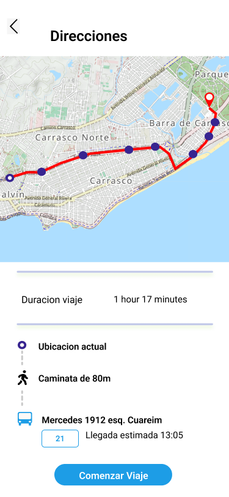
  
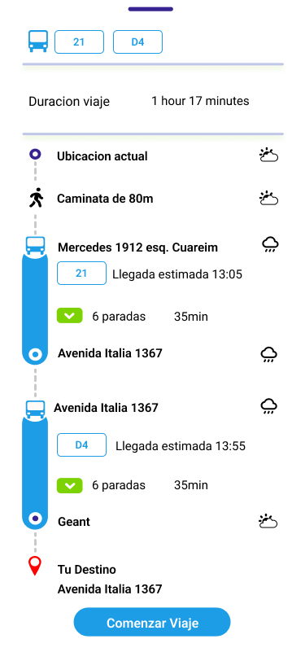
 
Cuando se selecciona comenzar viaje es que el sistema muestra el trayecto real del mismo. 
 
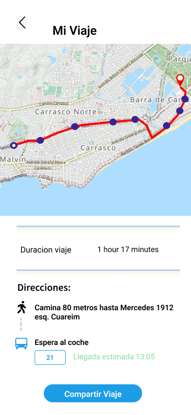
 
Si el usuario no cuenta con una conexión wifi el sistema muestra un mensaje de error.
 
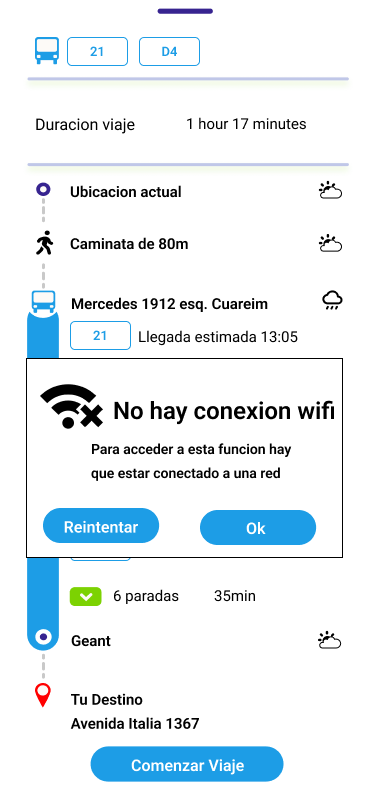
 
#### US 8:
Si nos encontramos en un viaje, las paradas se pueden ver en el mapa del viaje. Cada parada del trayecto sería un punto violeta en la ruta.
 

A la vez, en el detalle del viaje, se puede acceder a las paradas mediante el botón verde encontrado en el resumen de la ruta. 
 
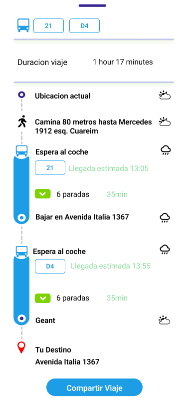
  
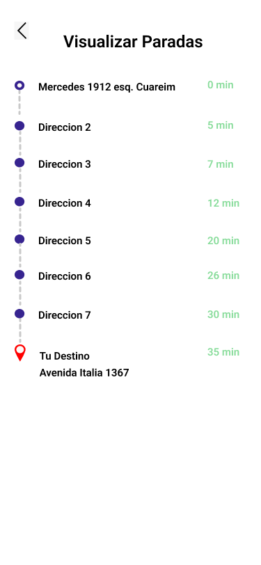

#### US 9:
Si nos encontramos en un viaje y clicábamos sobre el icono de compartir; podremos hacerlo a través de Whatsapp o mensajes a un contacto, tal como se muestra a continuación:
 

  

  
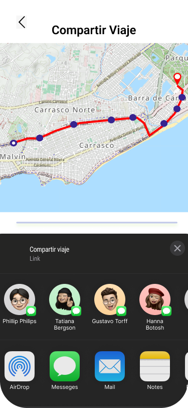
 
Si el usuario no posee una conexión a la red entonces al tratar de compartir viaje entonces se muestra un mensaje de error.
 

 
#### US 10: 
 En el menú principal al hacer click en el cuadro de texto de “¿A dónde quieres ir?” se nos muestra el historial de nuestros últimos viajes realizados en los últimos 30 días, de tal manera que si clickeamos sobre un destino podremos repetir el viaje hacia al mismo como se muestra en el siguiente prototipo:
 

  
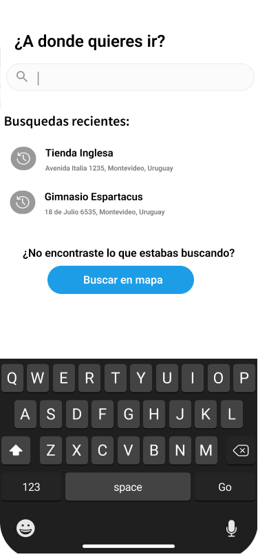
 
## Sprint Review y Sprint Retrospective

La Sprint Retrospective de esta iteración, llevada a cabo después de la Sprint Review, fue guiada por el Scrum Master correspondiente al completar el sprint backlog de la actual iteración. Allí se destacó como aspecto que el equipo debía mejorar, el hecho de la organización de la ejecución de las tareas, ya que se ejecutaban y luego se perdía mucho tiempo agregando detalles que no fueron tomados en cuenta desde un principio. Además mejorar la comunicación para no estar trabajando sobre lo mismo. Debido a lo comentado anteriormente no se pudo completar todas las tareas planeadas para este sprint por lo que se pasaron nuevamente al product backlog para ser priorizadas nuevamente.
 
En la sprint review llevada a cabo para esta última iteración se obtuvo el feedback de interesados de diferentes edades y de todo el país del territorio nacional para cubrir todo el posible mercado de usuarios que llevarían a cabo el uso de la aplicación. El prototipo que fue presentado mostraba las funcionalidades requeridas correctamente y de forma accesible, debido a que todos los usuarios pudieron realizar las tareas asignadas, de manera rápida e intuitiva. 

# **Sprint 3**
 
### Roles:
 
Pablo Tomas Martinez (Developer).
Amar Premchand (Scrum Master, Developer).
Salvador Panissa (Product Owner).

## Sprint planning 

El objetivo de la siguiente sprint agregar funcionalidades de feedback para mejorar la experiencia de usuario y agregar el modo offline, funcionalidad que nos diferenciará de la competencia. 

Para este sprint contamos con una referencia de velocidad del equipo la cual fue de 28 puntos de trabajo en el sprint. Tomando en cuenta lo analizado en la retrospectiva, podemos esperar mejorar la comunicación y organización para así estar más atentos a los errores en esta sprint, de esta manera mejorar nuestra velocidad como equipo.

## Story map

Como consecuencia de nuestra planeación hemos actualizado el story map el cual quedará de la siguiente forma:

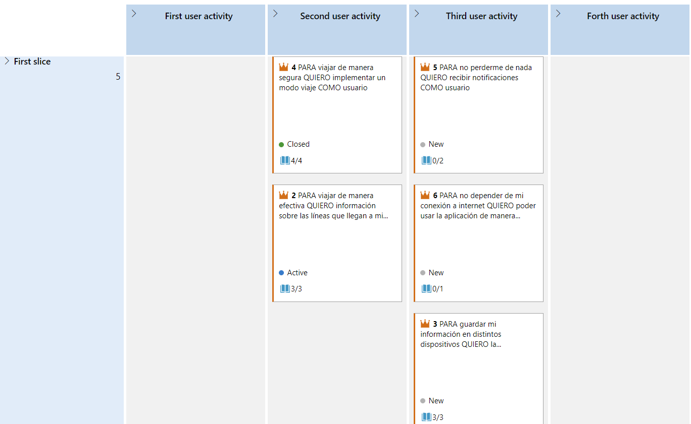

## Sprint Backlog

A partir del objetivo del sprint y la priorización de las historias decidimos en esta sprint realizar las épicas 2, 4 y 5 con sus historias de usuario correspondientes. Con esto y lo completado anteriormente ya podemos tener una versión casi final del productos con todas sus funcionalidades.

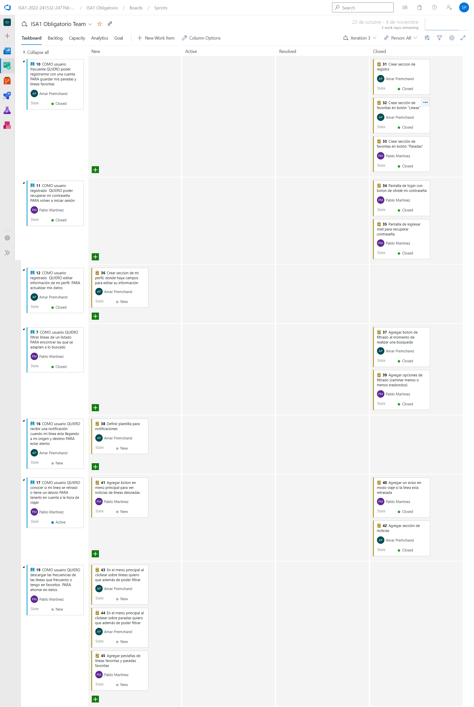

## **Prototipos**

#### US 4:
Para la sección de registro decidimos crear una barra lateral donde el usuario podrá iniciar sesión o registrarse.

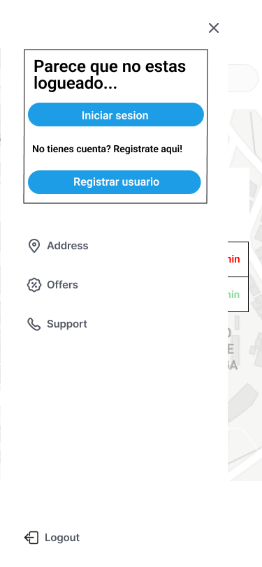

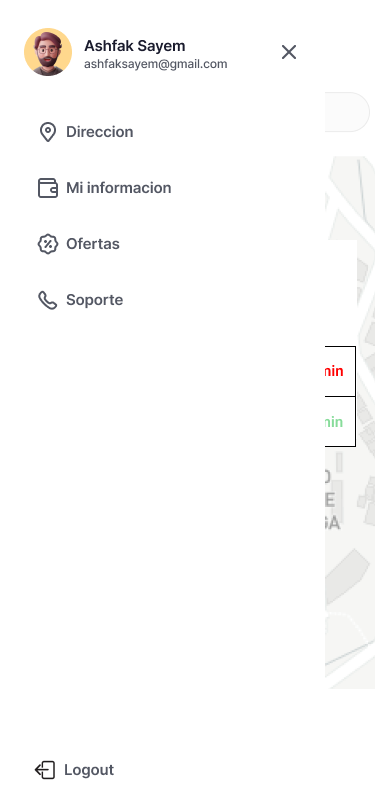

En el caso de que estemos logueados entonces podremos agregar líneas y paradas a favoritos clickeando sobre "Líneas" y "Paradas" respectivamente en el menú principal y acceder a las mismas desde allí.

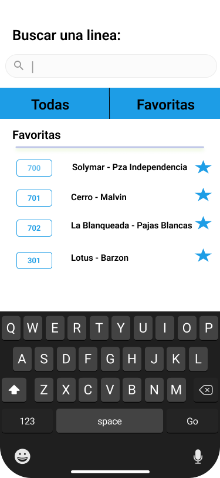

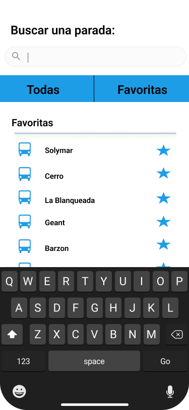

#### US 5:
Al momento de iniciar sesión tenemos la opción de olvidar nuestra contraseña, al clickear sobre "Forgot your Password?".

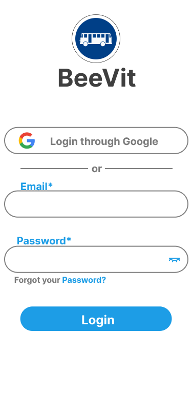

Si el usuario selecciona este botón se le envía un correo al email ingresado con instrucciones para recuperar la cuenta.

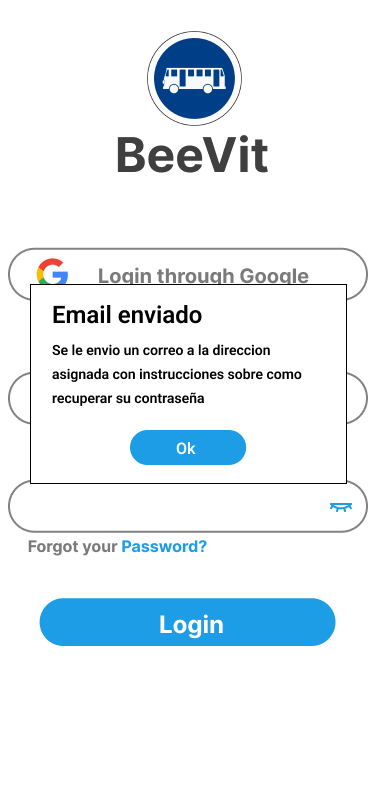

#### US 6:
A la hora de buscar las paradas, estas se deberían poder filtrar por paradas además de poder visualizar las paradas marcadas como favoritos.

#### US 2 - ID 8:
Cuando el usuario selecciona un origen y un destino del viaje, aparecen todas las posibles combinaciones de trayectos que lo llevan a ese destino. Allí el usuario en base a sus preferencias de tiempo de viaje, cantidad de trasbordos, línea favorita, etc., puede decidir que viaje tomar.

#### US 3 - ID 9:
El usuario puede ver el tiempo estimado de llegada de su ómnibus en tiempo real una vez que selecciona la opción de iniciar viaje. 

#### US 4 - ID 10:
El usuario puede registrarse a traves de la barra de navegación. 

Una vez que se selecciona el botón de registro, se abre un modal con el formulario de registro.

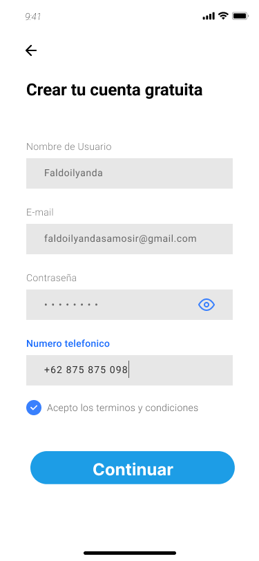

El usuario llena los campos y selecciona el botón de "Registrarse". Luego de eso se le envía un codigo de confirmación a su numero telefónico que luego es usado para verificar la cuenta.

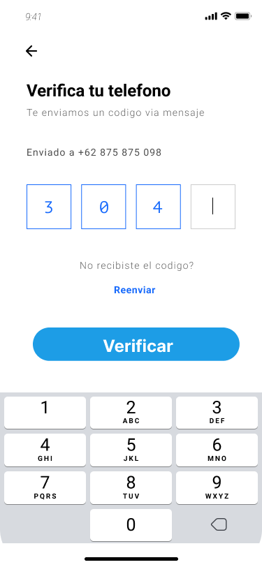

Una vez que se verifica el numero de teléfono, el usuario puede iniciar sesión con su cuenta en seleccionando la opción de login.

#### US6 - ID 12:
Una vez que el usuario esta registrado, el mismo puede editar su información personal, como por ejemplo el numero de teléfono, el email, etc. Esto se puede hacer desde la barra de navegación, seleccionando la opción de "Mi información".

Seleccionando la opción de "Mi información" se abre un modal con la información del usuario.

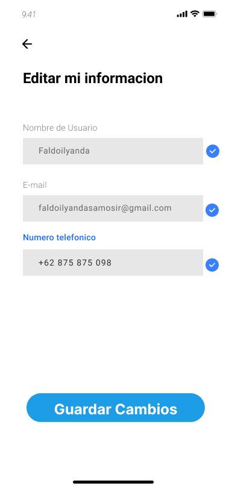

Una vez que el usuario selecciona el botón de guardar los cambios estos quedan efectuados

#### US 7 - ID 13:
El usuario puede ver las paradas de su viaje de dos maneras, una es mediante el mapa cuando el usuario esta en modo viaje.

Como se puede ver en el mapa, los puntos violetas son las paradas. Las paradas por las cuales el usuario ya paso se muestran con un circulo con relleno blanco y las paradas por las cuales el usuario aun no paso se muestran en color violeta.

La otra es mediante el detalle del viaje, presionando el botón verde.

Presionando este botón abre un modal con el detalle de las paradas y el tiempo que falta por llegar a las mismas.

#### US 8 - ID 14:
Una vez que el usuario selecciona el botón de iniciar viaje, se le muestra un modal con el detalle del viaje, el cual incluye el tiempo estimado de llegada, el tiempo que falta para llegar a la parada, el tiempo que falta para llegar al destino, el tiempo que lleva llegar al destino.

Presionando este botón podemos ver el modal con el detalle del viaje.

#### US11 - ID 16:
Una vez que el usuario se encuentra en un viaje, la aplicación envía notificaciones al usuario cuando el viaje esta por comenzar y cuando el viaje esta por finalizar.

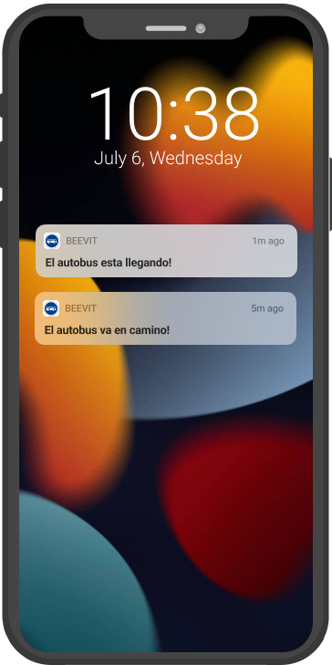

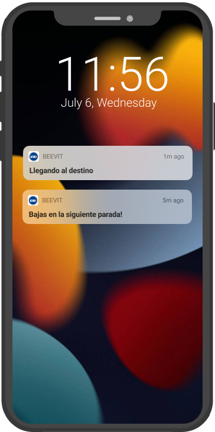

#### US 12 - ID 17:
El usuario puede ver el tiempo estimado de llegada de su ómnibus en tiempo real una vez que selecciona la opción de iniciar viaje.
Si el omnibus viene retrasado se muestra en rojo el nuevo tiempo esperado de llegada.

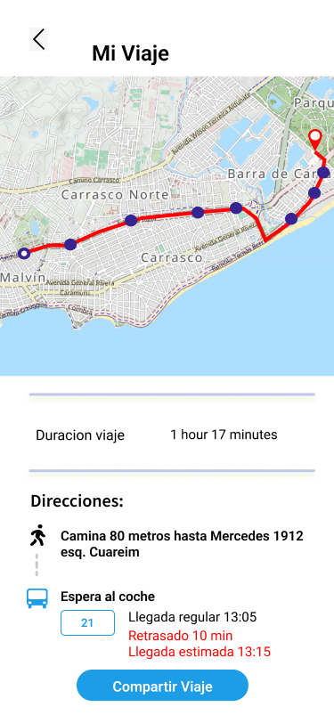

#### US 13 - ID 19:
El usuario puede descargar la información de las líneas ingresando al botón inferior de ver líneas. 

Una vez que el usuario selecciona el botón de ver líneas, se le muestra un modal con el listado de las líneas.

Desde este modal, el usuario puede buscar o seleccionar la línea que desea descargar. Apretando esa línea, se amplia la información de la misma.

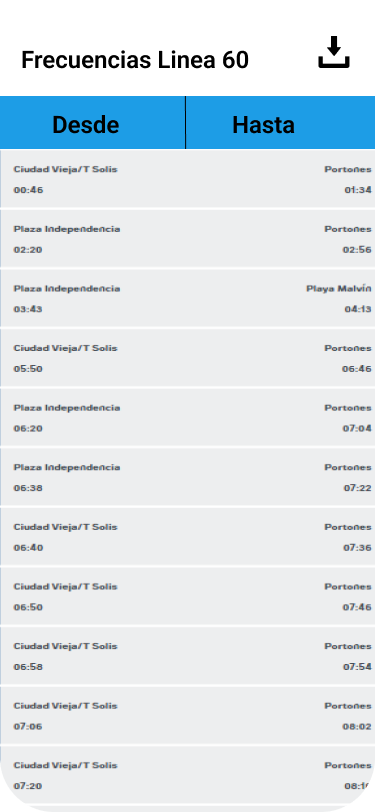

Una vez que el usuario amplia la información, se le muestra un modal con la información de la línea y el botón de descargar.
Si el usuario presiona este botón, esta línea es descargada. Luego puede acceder a ella desde el botón de "Líneas" en la pantalla principal. Donde mediante un icono verde se indica que la línea esta descargada.

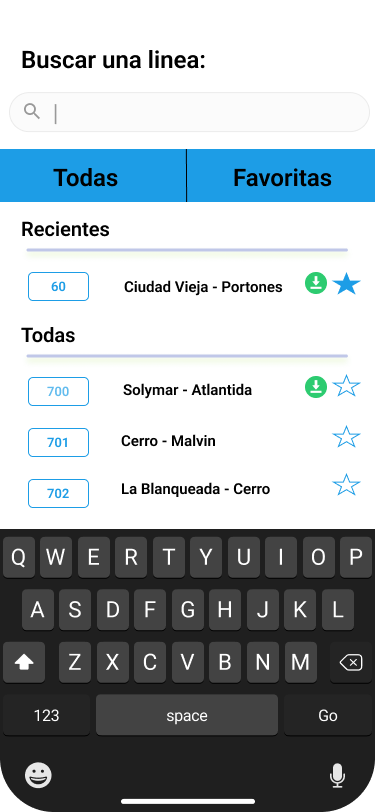

#### Burndown Chart

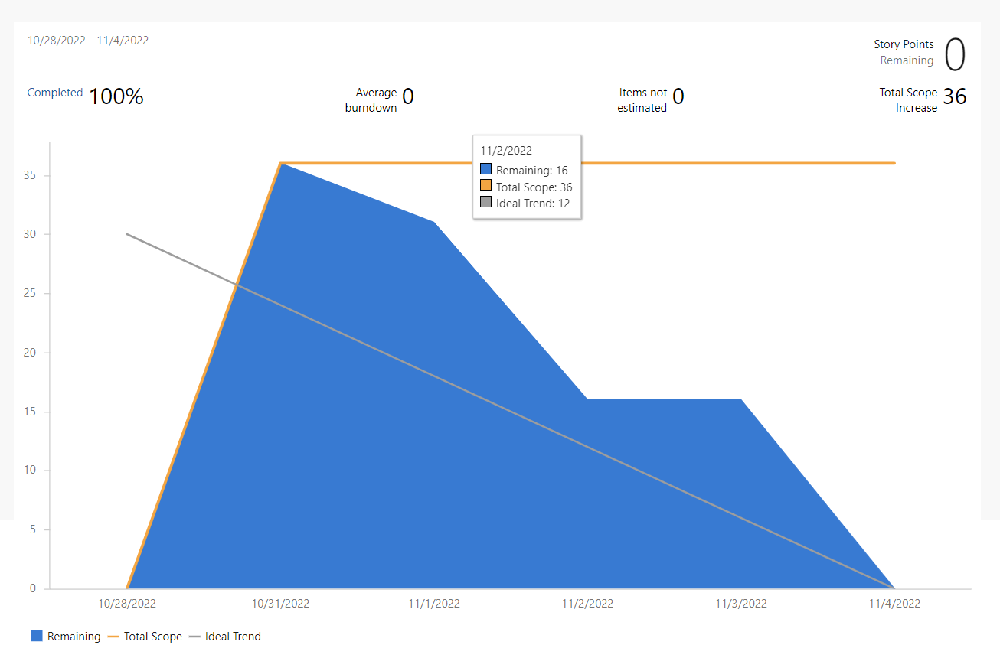

El Burndown Chart hace visible el trabajo del equipo ya que es una representación gráfica que muestra la velocidad a la que se completa el trabajo y cuánto queda por hacer. Como se puede observar, el gráfico se inclina hacia abajo a lo largo de la duración del Sprint y a través de los Puntos de Historia completados. Esto es un indicador de que el equipo está trabajando a un ritmo constante y que el trabajo se está completando a tiempo. 
La gráfica muestra la suma de puntos de historias que se asignaron para la iteración el cual fue de 36. Como se puede observar todas fueron completadas para el final del sprint.

## Validación con usuarios

Se realizaron entrevistas a posibles usuarios para validar el producto. Los posibles usuarios seleccionados fueron personas que usan el transporte público en la ciudad de Montevideo. Estos fueron:
- Usuario 1: 21 años, estudiante de ingeniería, usa el transporte público 4 veces por semana.
- Usuario 2: 24 años, estudiante de ingeniería, usa el transporte público 2 veces por semana.
- Usuario 3: 27 años, estudiante de derecho, usa el transporte público todos los días semana.

Los usuarios fueron entrevistados en la oficina de la empresa. Se les mostró el producto y se les pidió que lo usaran. Luego se les hizo una serie de preguntas para validar el producto. Las preguntas fueron:

#### ¿Qué te parece el diseño del producto?
En general tanto al usuario 1 como al usuario 2 les pareció intuitiva la interfaz del producto. El usuario 1 dijo que le gustó el diseño y el usuario 2 dijo que le pareció muy intuitivo. Por el lado del usuario 3 le agradó cómo se le informa al usuario sobre los casos erróneos de acciones, cómo las validaciones de las funcionalidades que requieren el uso de internet.

#### ¿Qué te parece la usabilidad del producto?
A todos los usuarios les pareció que la usabilidad del producto era óptima, dijeron que como la aplicación facilita la lectura de los textos y presentan funciones y menús sencillos. Una cosa que nos comentó el usuario 2 es que le gustaría que la aplicación brindara la opción de ingresar sesión con google y nos pareció una funcionalidad que podría aportar valor al producto por lo que en la daily meet se propuso implementarla. Al usuario 3 le hubiese gustado que la aplicación tenga su versión en otro idioma, ya sea el inglés, debido a que conoce a mucha gente de otros países que desconocen el idioma de español.

#### ¿Qué te parecen las funcionalidades del producto?
A ambos les gustaron las funcionalidades que brindaba la aplicación. El usuario 1 dijo que era todo lo que esperaba de una aplicación de transporte. En relación al diseño de la aplicación, el usuario 1 planteo la posibilidad de poder marcar a las líneas como favoritas mediante un simple botón reactivo. Por ello fue que se diseñó el componente de la estrella que representa las líneas marcadas como favoritas. El usuario 2 dijo que a pesar de que las funcionalidades que provee la aplicación son de suma utilidad, una buena funcionalidad para agregarle a la misma seria la posibilidad de poder pagar el boleto de transporte mediante la app con el fin de evitar usar dinero en efectivo. Nos pareció una buena idea y se discutió la posibilidad de agregarla pero requería un cambio grande en la infraestructura de la aplicación por lo que decidimos no prover esa funcionalidad.

#### ¿Qué te parece la información que se muestra en el detalle de la línea?
Al usuario 3 le pareció de gran utilidad ya que al transportarse en ómnibus todos los días, le sirve para ver dónde es la parada que más cercana que le sirva desde un origen que no suele frecuentar. Por otro lado, a los otros dos usuarios les encantó también, pero no es algo que usarían tanto ya que lo usan para ir a lugares conocidos, si no conocen ese lugar, usan algún otro medio de transporte.

#### Evidencia de entrevistas

##### Entrevista con los usuarios 1 y 2

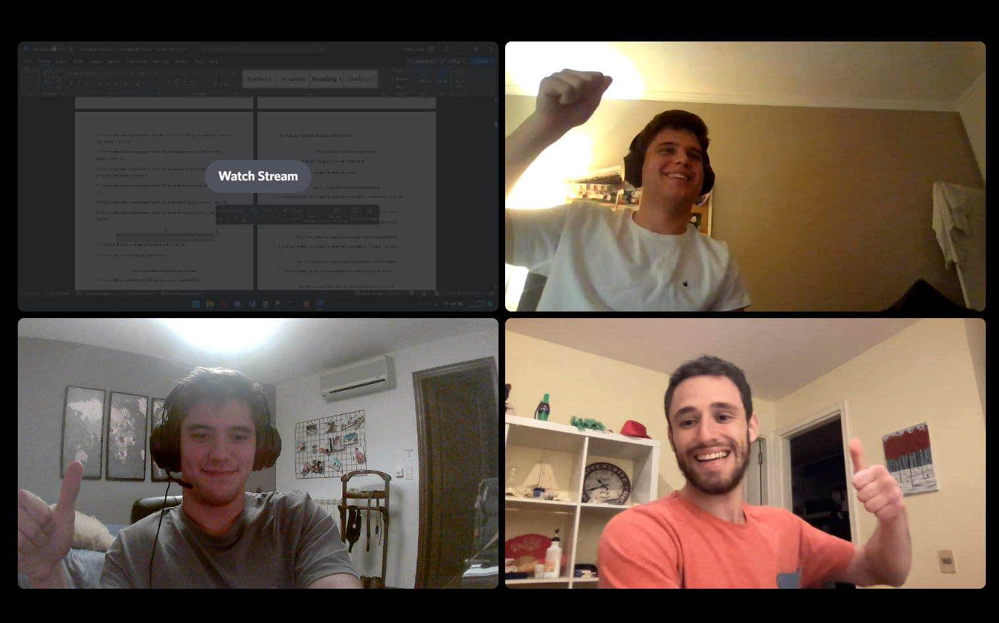

## Adaptación de Daily Scrum

Con respecto a las "Daily Scrum", como se trata de un proyecto en el cual el equipo no trabaja tiempo completo se decidió tener 3 por semana. Usualmente se realizaban los dias Lunes, Miercoles y Viernes pero debido a factores externos, a veces era necesario suspender un dia y pasarlo para el dia siguiente. El equipo siguió un orden estipulado para que cada integrante pueda informar a los demás sobre las tareas que había hecho y las que va a realizar en un futuro. Este orden establecido era por orden alfabético de los nombres de los integrantes del equipo. Cada vez que le tocaba hablar a alguno no sólo se informaba de lo trabajado, sino que también si precisaba ayuda en alguna tarea y también algún detalle que se consideraba informarle al equipo (por ejemplo los días de licencia).

## Sprint Review y Sprint Retrospective

Gracias a la retrospectiva de la última iteración pudimos mejorar la comunicación del equipo, esto junto con una mayor organización y mejor dominio del problema conllevo a que el equipo haya tenido un mejor desempeñado en la sprint. Lo anterior se vio traducido en la velocidad del equipo, cumplimiento con el objetivo y planeación de la iteración y eficiencia del equipo.

## Roadmap

Aquí podemos observar el "Roadmap" del proyecto, el cual se observa las historias de usuario que fueron hechas en cada iteración. Esto brindó y aseguró que los objetivos a corto plazo se cumplan mientras se controla y ajusta al objetivo principal a largo plazo, que sería el producto final.

